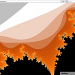
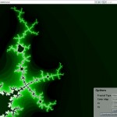
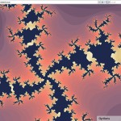
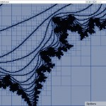
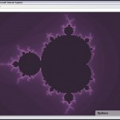

Last weekend, I won a nice new Toshiba laptop in a local software competition. My entry was a web-based fractal explorer. I had a lot of fun making it, and it is fun to play with as well. I have decided to release it under an open-source license so that other people can play around with it (see the download link at the bottom of this post).

Unfortunately, I do not have access to a powerful Tomcat server with a lot of bandwidth, so I can’t host an online demo.

Here are some screenshots of the application in action:

Since it is a web-based application, any supported web browser can be the client (see the documentation for a list of supported browsers; any modern Gecko-based browser is supported as well as IE and Opera.) The client interface is loosely based on Google Maps. The server is a Java Servlet run through Tomcat. You can read more about how it works in the documentation.

[The source code is hosted on GitHub](https://github.com/paulgb/webFractal)

