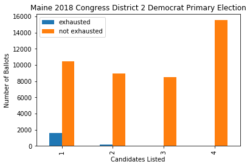
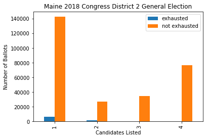
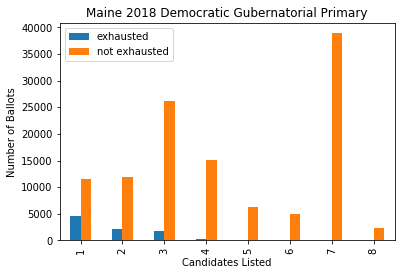
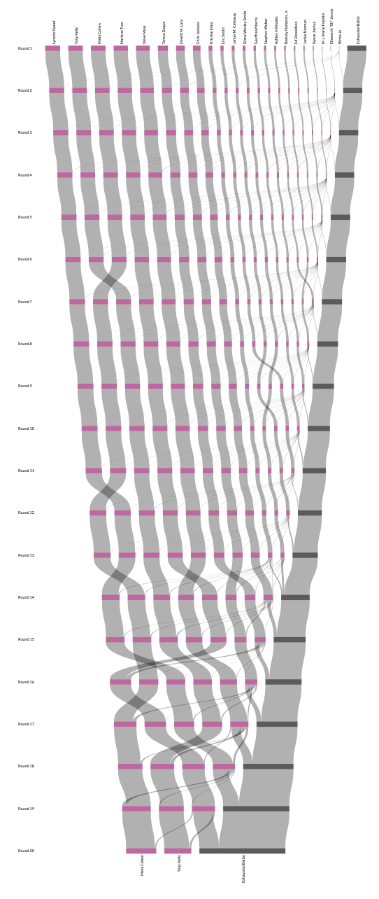
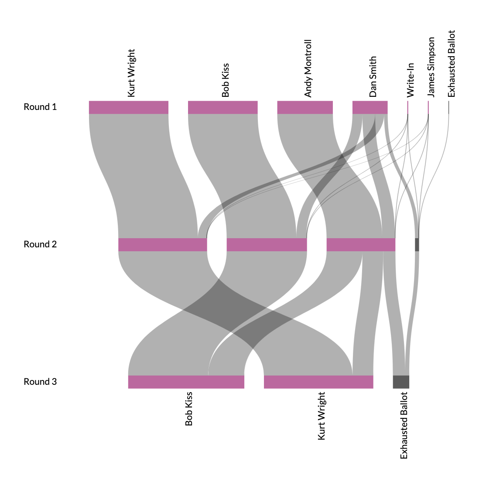

Over the past year, I have undertaken [a project](https://ranked.vote) to analyze instant runoff elections at the ballot-level across multiple cities and states. To date, I have processed 31 instant-runoff elections, which has involved implementing in code the ballot counting and tabulation methods of five localities. In the process, I’ve gained some insight into how the instant runoff process works (and when it doesn’t), obscure trivia of state-to-state implementation differences, and tools for analyzing election results.

The Maine Heritage Policy Center recently released the report *[A FALSE MAJORITY: The Failed Experiment of Ranked-Choice Voting](https://mainepolicy.org/wp-content/uploads/RCV-Final-Booklet-.pdf)*, which summarizes some of the popular arguments against ranked-choice voting (RCV). I think the report is written in good faith, and for the most part, I also agree with the authors on their fundamental model of how an election system should be judged. And yet, while reading it, I found a number of parts where I felt that aspects of election systems (both RCV and plurality) were mischaracterized; parts where relevant locality-specific factors were overlooked in drawing comparisons; and parts where a deeper dive into ballot-level data can add color to the arguments made by the report. I’d like to use this post to comment on some of those areas.

---

After outlining how RCV works and its turbulent history in Maine, the report begins making its case against it with this claim:

> In a plurality election, the choice facing voters is simple: Of all the candidates running, whom do you prefer?

This is contrasted with a more complicated choice in an RCV election:

> Ranked-choice voting entails a much more complicated — and somewhat artificial — decision. To fully participate, voters must rank-order all of the candidates.

This is a misleading premise. The minimum bar for participation in an RCV election is the same as with plurality: check one box for your favorite candidate and leave it at that. Granted, it may take a little more effort to find that box, but that’s a far cry from the burden presented here.

The sleight-of-hand here is to compare the *minimum* bar for participation in plurality with the *maximum* possible expressiveness in RCV. The load-bearing words are “to fully participate,” implying that casting a complete ballot is tantamount to maximizing the power of your ballot. This is neither true in plurality nor in RCV elections.

In plurality elections, a voter who asks only *whom do I prefer* takes the risk of diminishing the electoral power of his vote. To ensure the power of his vote is maximized, the voter must also ask: *Does my favorite candidate have a chance of winning? If not, am I indifferent enough to the frontrunners that I am willing to vote for her anyway? Would I rather vote for a less-preferred candidate who has a better chance of winning?*

Taken to the extreme, plurality voters need to engage in a sort of [Keynesian Beauty Contest](https://en.wikipedia.org/wiki/Keynesian_beauty_contest) just to maximize the probability that their vote has any actual electoral power. In practice, voters find a balance between the extremes of effort that they are comfortable with.

Similarly, with RCV, voters find a balance along the spectrum of effort and electoral impact. We can see how this plays out by looking at the ballot-level data. Below, I’ve plotted the number of ballots cast in each of Maine’s RCV elections, broken up by how many candidates were ranked on each ballot and whether the ballot was “exhausted” or not. Exhausted ballots are the only ballots which would have carried more power had the voter ranked additional candidates. As you can see, in practice, most voters do not rank every candidate, and overwhelmingly these shorter ballots are not exhausted.

    

    

    

 

The report then considers whether less-knowledgeable voters have the power of their vote diminished disproportionately under RCV:

> Less knowledgeable voters are more likely to rank fewer candidates, potentially denying them influence over the election outcome. Giving knowledgeable voters more electoral influence may be defensible as a matter of political philosophy, but it is surely not the intent behind Maine’s adoption of ranked-choice voting.

I agree that it would be undesirable for an electoral system to inadvertently disadvantage less-knowledgeable voters. I find the rest of this argument tenuous. As I argued above, knowledgeable voters are *already* advantaged in a plurality system: they can use additional information to vote tactically. If anything, RCV *reduces* the disadvantage that regular voters have against tactical voters, since instead of considering both their own preferences *and* the probabilities that a vote for each candidate will matter, they can consider only their own preferences. (While there *are* cases where strategic voting is rewarded [in every voting system](https://en.wikipedia.org/wiki/Gibbard%27s_theorem), they are rarer and less predictable than under plurality.)

The report goes on to analyze exhaustion rates in various races, but these comparisons can be apples-to-oranges if you don’t consider the particulars of each jurisdiction. For example:

> The most extreme example was from the 2010 San Francisco District 10 Board of Supervisors race, where the prevailing candidate received less than 25 percent of the votes cast.

The [2010 District 10 race](https://ranked.vote/us/ca/sfo/2010/11/d10/) was indeed a mess. From the diagram of the runoff process below, you can see how the size of the “exhausted ballot” group grows at each runoff round. Besides the sheer number of candidates, there is a reason for this: at the time, San Francisco allowed voters to rank only three candidates due to technical limitations. [They have since increased this to ten](https://www.sfchronicle.com/bayarea/article/Possible-new-election-twist-for-voters-who-want-13109151.php), and the system already in place in Maine is not as limited: it guarantees voters [at least six spots](http://www.legislature.maine.gov/legis/statutes/21-A/title21-Asec723-A.html) to rank candidates, but that’s only a minimum; in every Maine RCV election thus far there have been at least as many rank slots as candidates, including a [seven-candidate Gubernatorial primary](https://ranked.vote/us/me/2018/06/gov-primary/).

    

Despite the problems with using this race as an example, though, the report has a valid point — RCV supporters who claim that RCV will **always** deliver a majority winner are wrong.

The report then moves on to talk about whether ballot errors are more common in RCV elections:

> In Australia, which has used ranked-choice voting in its legislative elections for more than a century, officials still report a much higher rate of invalid ballots than comparator countries like the United States

It’s a major omission to not also mention that [Australia has also had compulsory voting](https://www.aec.gov.au/Voting/Compulsory_Voting.htm) during the same period — Australian citizens are fined for not showing up to the polls. This increases voter turnout, but also means that voter apathy manifests as spoiled (“informal”) ballots rather than non-turnout, as it does in countries with voluntary elections.

Later, the report considers an interesting theory that there is a “blackmail” mechanism under plurality that actually empowers third parties.

> In addition, much of third parties’ power in the U.S. derives not from the number of elected positions they hold, but from their ability to influence major party candidates to cater to “ideological minorities.” Jason Sorens, a lecturer at Dartmouth College, outlines the loss of third parties’ “blackmail power” as a disadvantage of instant run-off voting because it allows major party candidates to ignore third party constituencies.

[Sorens’ argument](https://www.cato-unbound.org/2016/12/09/jason-sorens/false-promise-instant-runoff-voting) is that because voters are forced to either vote third party or for a major candidate (but not both), major candidates are encouraged to consider the preferences of voters who have a viable threat of voting third party, lest they make good on that threat. Of course, there’s nothing stopping voters from deciding to *only* vote for one candidate on a ranked ballot. For the argument to work, it is implicit that voters given the option to rank multiple candidates will prefer to do so, rather than acting to preserve the power of their preferred third party by voting only for them.

Sorens, a libertarian, posits that this mechanism is a source of power for the Libertarian Party in the United States. There is a fun irony to this idea: that the *party of individual freedom* has power, in part, because the election system constrains voters to an us-or-them decision, instead of giving them a third option to express their ranked-order preferences. To argue that these voters are made better off collectively from restricting the choices of the individual smacks of the same sort of government paternalism that ideological libertarians abhor.

In any case, this mechanism seems to be more of a post-hoc rationalization of plurality voting, rather than something you would intentionally build into a system. For one thing, it disproportionately empowers third parties who are indifferent to the mainstream candidates, since they are the ones with the most viable threat of voting third party. To Sorens’ credit, he treats his own argument as more of an observation than the prescription that the report takes it as. Sorens then goes on to argue in favor of [approval voting](https://www.electionscience.org/library/approval-voting/), another system of voting which I also happen to like.

Towards the end, the report brings up the topic of paradoxical effects in RCV elections. As an example, the report points out that in the [2009 Burlington Mayoral election](https://ranked.vote/us/vt/btv/2009/03/mayor/):

> [...] the candidate who was preferred over all other candidates in a head-to-head race, Andy Montroll, lost the election via ranked-choice voting. This demonstrates the issues caused by a non-monotonic voting system.

This is probably the best criticism of RCV in the report. (Technically, this is specifically a criticism of instant-runoff voting, as there are RCV methods like [Ranked Pairs](https://en.wikipedia.org/wiki/Ranked_pairs) that would have picked Montroll from the same ballots, but I digress.)

    

Burlington tends to be the go-to example of how RCV can fail, and deservedly so. But it’s worth pointing out that these failures *necessarily* also occur in cases where plurality would most likely fail. In this case, Montroll is only the third-most popular candidate by first-choice. It would be a tall order to convince voters who prefer Wright or Kiss to strategically defect to a candidate who is (at least on the surface) less popular.

Election methods shape the politics we get, so it’s important to get them right. There is certainly more to an electoral system than whether it elects the best candidate in a game theorist's notebook, and I give the report credit for acknowledging some of the real-world attributes that make an electoral system good or bad. Although I disagree with the reports’s conclusion that plurality is superior to RCV, it does bring up some points that RCV advocates need to have good answers for (voter education being one), and it makes the fair point that RCV advocates tend to overstate its advantages (such as guaranteeing a majority winner).

It’s also worth noting that a comparison of voting systems in use in the United States will soon be incomplete without approval voting, which [will soon be used](https://www.vox.com/future-perfect/2018/11/15/18092206/midterm-elections-vote-fargo-approval-voting-ranked-choice) in Fargo, ND and has some nice properties that appeal to skeptics of both plurality and RCV.
