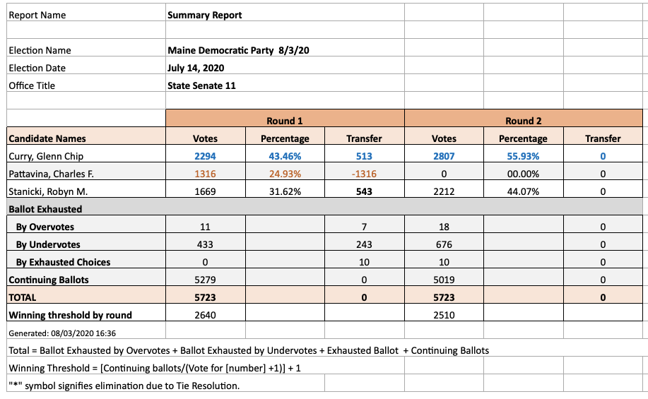
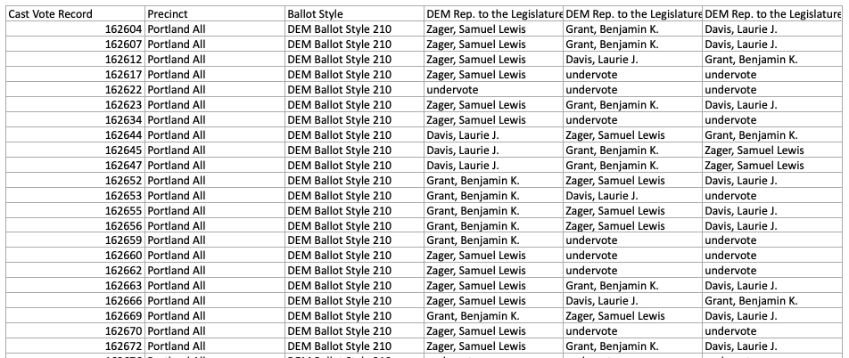
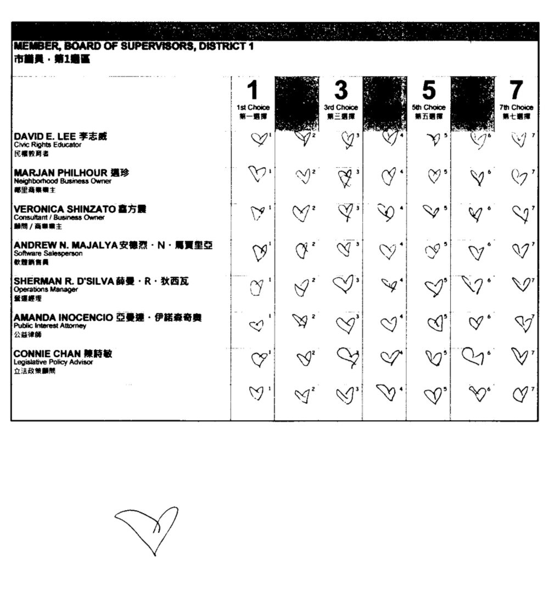

In a few weeks, New York City will become the largest US jurisdiction to use instant-runoff voting when it votes for the .

Ranked-choice elections generate a lot of data. It's not clear yet how much of this data the New York City Board of Elections will release immediately following the election — [a bill](https://www.nysenate.gov/legislation/bills/2021/S286) that would mandate a broad data release did not pass before the assembly adjourned on Friday. But if the NYC BOE follows in the footsteps of other jurisdictions which have run ranked-choice elections, we can hope to get at least the **cast-vote record** in addition to the **tabulation record**.

# Types of data

## **Tabulation records**

In instant-runoff voting, the winner is determined by a series of rounds in which the candidate(s) with the least votes are eliminated and their ballots redistributed to the top-ranked remaining candidate. Each iteration of this process is called a **round**. The tabulation is the count of each candidate's votes at each round.

Some form of tabulation record is always made public, although often it's in a PDF file rather than as nice structured data.

The tabulation data gives *some* information on voters’ preferences that isn't reflected in the final-round results, but it generally isn't useful for any sort of analysis because it's an incomplete picture. To do anything interesting, you need at least the cast-vote record.

## **Cast-vote record**

The cast-vote record (CVR) is ballot-level data that shows how each (anonymized) voter ranked each candidate. It may also include information like a precinct or a unique identifier.

In most cases, each ballot cast in a particular contest has a corresponding row in the CVR table. In rare cases, jurisdictions group ballots containing the same ranking into a single record and include a count. This is just a way of compressing the data and doesn't change what can be done with it.

Cast-vote records may be released in a number of different ways:

- [NIST CVR](https://www.nist.gov/publications/cast-vote-records-common-data-format-specification-version-10) is a comprehensive format for reporting cast-vote records for a variety of types of elections, including ranked ballots. It specifies a representation that can be encoded either as XML or JSON; in practice JSON appears to be more popular.
- [Dominion Ranked Choice Results](https://www.sos.state.co.us/pubs/elections/VotingSystems/DVS-DemocracySuite/documentation/EMS_RTR_UserGuide.pdf) (RTR) is a text-based format that some Dominion tabulators output.
- Bespoke Excel/CSV formats. Usually, each column is a ranking and each row is a ballot, with the candidate's name in each cell.

This list isn't exhaustive; I've encountered other text-based formats and even (regrettably) a many-page PDF.

Here's a screenshot of the Excel file format that Maine uses to release CVRs.

Jurisdictions differ in how they deal with voter errors, such as giving two candidates the same rank (**overvote**) or skipping/omitting a ranking (**undervote**). NIST CVR provides a way to include both the raw marks that were found on the ballot, as well as the final interpretation of those marks. Bespoke formats may simply indicate “overvote”. Knowing that a voter overvoted at a given rank is enough information to compute the tabulation.

## **Ballot images**

In some jurisdictions, actual scanned images of the non-identifiable portions of each ballot are available. These don't provide much data of interest that isn't already in the CVR, but they can be handy for debugging data issues. For example, this San Francisco ballot stood out in the data so I used San Francisco's ballot image dataset to see what was going on.

❤️ back atcha, anonymous voter. But maybe don't throw away your vote next time.

# Using the data

Once I have my hands on the cast vote records, I like to audit the official tabulation. This way, I can catch any errors in my analysis and make sure my handling of ballot errors matches the jurisdiction's process.

## Normalizing the ballots

The sort of analysis we generally want to do on ranked-choice ballot data involves knowing the order of preferences among the candidates, as expressed by each voter. For these types of analyses, ballot errors are an unnecessary complication. To simplify things, I like to start by converting the actual ballots into “clean” ballots that meet two conditions:

1. Each ballot has exactly zero or one candidates in each rank position.
2. On a particular ballot, a rank position with one candidate never follows a rank position with zero candidates.

The way I do this conversion depends on the jurisdiction's handling of voter errors. For example, some jurisdictions will simply skip over any ranks without votes, whereas other jurisdictions will skip over a maximum of one rank in a row before exhausting the rest of the ballot. Because I'd like to use the normalized ballots to recreate the official tabulation, I stick to the way the jurisdiction handles voter errors.

In most cases, this involves looking up either the city charter or other document that governs ranked-choice elections. For example, here's the [relevant law for New York](https://codelibrary.amlegal.com/codes/newyorkcity/latest/NYCcharter/0-0-0-3079).

## Auditing the tabulation

After normalizing the data, you can run a tabulation to compare to the official results. There are a few ways to tabulate an instant-runoff election which mathematically guarantee the same winner but produce different numbers in tabulation. The two dimensions they vary on are:

1. Whether multiple candidates can be eliminated in each round, or only one. This is sometimes called **batch elimination**. In IRV, a set of candidates can be eliminated without affecting the final winner as long as each *remaining* candidate in that round has more votes than all of the candidates being eliminated. This is just a short-cut for tabulation.
2. Whether tabulation ends as soon as one candidate has a majority of the non-exhausted votes, or whether there is a forced round against the two candidates with the most votes in the penultimate round. This is purely done in order to provide additional data, since the winner is already known going into this round.

Although the tabulation details can also be found in the jurisdiction's laws, if they matter to the tabulation of a particular election, you can also figure them out by looking at the official tabulation numbers: are there any rounds in which multiple candidates were eliminated? Does the ultimate winner reach a majority of the non-exhausted vote before the final round?

Once you know these rules, here's a sketch of how tabulation can be implemented:

1. Create an empty bin (array, vector, whatever) for each candidate, and an empty set of eliminated candidates and another empty set of exhausted ballots.
2. Loop over all of the ballots, placing each one in the bin of the candidate ranked #1.
3. Until the stopping condition is met:
    1. Count the number of votes in each bin. Report this as the candidates' vote counts for the current round. Additionally, report the count of the exhausted ballots bin.
    2. Pick the candidate(s) who will be eliminated in the next round; either the single lowest-vote-getting candidate or a set according to batch elimination.
    3. Add the eliminated candidate(s) to the eliminated candidates set.
    4. Loop over the ballots in each eliminated candidates' bin, re-allocating it to the top non-eliminated candidate in rank order. If you reach the end of a ballot, move that ballot to the exhausted ballot bin.

When this process ends, the candidate with the most votes allocated is the winner.

Some jurisdictions report ballots exhausted by overvotes separately from those exhausted regularly. If you would like to match this, you can indicate in the representation of the normalized ballots whether they were exhausted by overvote, and if so store them in an “overvotes” bin instead of the “exhausted” bin when they become exhausted.

## Pairwise comparisons

Some types of analysis on ranked-choice ballots involve determining the fraction of the electorate that would prefer one candidate to another in a head-to-head race, taking the assumption that rankings represent true preferences. These analyses include finding a [Condorcet winner](https://en.wikipedia.org/wiki/Condorcet_winner_criterion) (if one exists), and computing the [Smith set](https://en.wikipedia.org/wiki/Smith_set).

To compute the pairwise preference between two candidates *A* and *B*, create two counters: one for voters who prefer *A*, and one for voters who prefer *B*. Then go over each normalized ballot in order of rank, and increment the counter associated with the first of *A* or *B* you encounter. If you get to the end of a ballot without encountering either, simply move on to the next ballot without incrementing anything.

At the end, you can take the fraction of each counter to get the fraction of voters who prefer each candidate. The fraction left over is the fraction of voters who did not express a preference.

Note that this approach counts a voter as preferring one candidate to another even if the voter did not explicitly rank each candidate. The assumption is that a voter ranking one candidate and not another implies that the voter prefers the ranked candidate to the unranked one.

A surprising fact of social choice theory is that group preferences are not transitive! A group can collectively prefer candidate A to candidate B, and candidate B to candidate C, but also prefer candidate C to candidate A. This is true even when individual voters' rankings *are* transitive. In this case, a Condorcet winner may not exist, and the Smith set will contain more than one candidate. I've never found a real-world election that did not have a Condorcet winner, but it might happen some day, so it's worth keeping in mind.

It's also possible for a Condorcet winner to exist, but not be chosen by the instant runoff process. This (in)famously occurred in the [2009 Burlington mayoral election](https://ranked.vote/report/us/vt/btv/2009/03/mayor).

# Writing about the data

When communicating results, there are some nuances to the terminology that you should consider. This section is a sort of style guide that I use when writing about elections.

## Ranked-choice vs. instant runoff

Technically, ranked-choice voting (RCV) is a family of election systems that involve voters providing a ranked ordering of candidates. Instant runoff voting (IRV) is a method that belongs to this family.

In practice, for single-winner elections, RCV is used in the wild synonymously with IRV, and seems to have become the more popular term in the US and Canada.

When writing for an audience who might find the distinction meaningful, I use “IRV” if I'm making a claim that's specific to IRV and RCV if I'm making a claim that applies in general to RCV methods, as I've done in this post.

## Counter-factuals

I advise caution when it comes to making claims that involve counter-factuals. By this, I mean making a claim (for example) that a candidate who did not win the first-round vote won *because* of ranked-choice voting. The fallacy here is that we can't infer how voters would have behaved in a plurality situation based on their first-round votes, because voters can and do vote strategically, especially in a plurality election.

I try even to avoid wording such as *candidate A **won** the first round*, because it's the same sort of dubious claim as saying someone *won* the first 100m of a 400m race: a fairly dubious and arbitrary distinction given that there's no prize for it. Instead, I would say a candidate *had the most first-round votes*.

## Majority winners

Winners of an IRV election are sometimes described as *majority winners* on the basis that they took a majority of the non-exhausted votes in the final round. I take issue with this usage, because I find it pretty much meaningless: it becomes impossible to define *majority winner* without either being so broad that multiple candidates could be considered “majority winners” in the same race, or else baking the IRV process into the definition such that “majority winner” means, by definition, the “IRV winner”.

Instead, I only use majority winner when a candidate took a majority of all cast votes, i.e. when the election was decided in the first round.

..

I hope this is enough to get you started with looking at ranked-choice vote data, but feel free to reach out if you have questions.