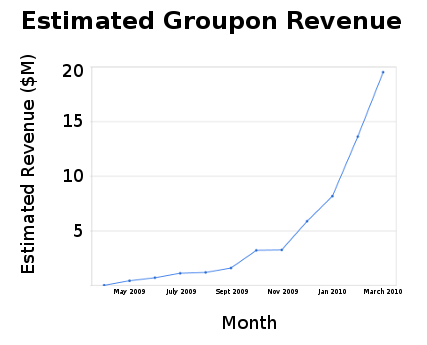
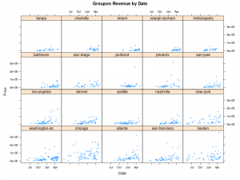

There’s been a lot of talk recently about the Chicago startup <a href="http://www.groupon.com/">Groupon</a>. Groupon brands itself as a group-buying site, but it’s really more of a localized version of what <a href="http://www.woot.com/">woot.com</a> does. They post a new deal (which they call a <em>Groupon</em>) every day, available only on that day. If enough people want to buy it, everyone gets it for a substantial discount. Otherwise, nobody gets anything, but this rarely happens from what I can tell.

<a href="http://techcrunch.com/2010/04/13/groupon-raises-huge-new-round-at-1-2-billion-valuation/">According to TechCrunch</a>, the company is in the process of raising money at a $1.2 billion dollar valuation. There was lots of speculation about the future worth of the company, but little information about current revenue, even though there is a lot of raw data readily available in the site’s archives. I put together a scraper (in just a few lines of Python, thanks to <a href="http://www.crummy.com/software/BeautifulSoup/">BeautifulSoup</a>) and gathered a total of 1065 past Groupons.

It isn’t clear how Groupon decides which Groupons to display in its archives. Presumably they are the better selling ones, so my sample is not a random sample, which would affect the numbers. Everything that follows should be taken with a grain of salt, but they should be reasonable as ballpark figures.

According to the data I collected, the average Groupon costs $30 and entitles the buyer to 57% off. On average 1155 people purchase it, resulting in $28,130 of revenue to Groupon ($28,130 is less than 1155 * $30 = $34,650 because, apparently, people are more willing to buy the cheaper Groupons.)

Averages are nice, but what I really wanted was totals. I was able to approximate what fraction of the data I had because Groupon advertises the “Total dollars saved” and “Total Groupons bought” on every page. By dividing my numbers by those, I determined that I had a little over a third of the data. Specifically, my data covered 31.2% of Groupons sold, and 37.4% of total savings.

Extrapolating the data I had (again, with the disclaimer that my sample may not be random), I calculated the total revenue since the beginning to be $80,188,176. If Groupon takes a 35% cut (to take a wild guess), $28 million of that is left after Groupon pays the company offering the deal. According to <a href="http://www.crunchbase.com/company/groupon">CrunchBase</a> Groupon employs 90 people. I won’t speculate as to the operating costs of Groupon over the last year and a bit of operation, but once you subtract that number the rest is profit to date.

Looking on a monthly basis, the recent growth of the company is clear. A third of the total savings — in over a year of business — happened last month. This works out to $26,706,059 in revenue last month alone, or about $9.3 million (less the operating costs) profit if you assume they take a 35% cut. The below graph shows the growth by month.

Whether or not it’s a $1.2 billion company (<a href="http://www.businessinsider.com/groupon-is-cheap-at-12-billion-2010-4">BusinessInsider says that’s actually low</a>, though without any quantitative justification), they’re clearly doing well for a company just over a year after launch.

Here are a couple more graphs constructed from the data

<strong>Update May 26, 2010</strong>: a few more graphs with more recent data follow.

