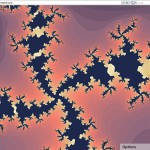

Last weekend, I won a nice new Toshiba laptop in a local software competition. My entry was a web-based fractal explorer. I had a lot of fun making it, and it is fun to play with as well. I have decided to release it under an open-source license so that other people can play around with it (see the download link at the bottom of this post).

Unfortunately, I do not have access to a powerful Tomcat server with a lot of bandwidth, so I can’t host an online demo. If anyone has the resources and is interested in hosting it, please let me know.

Here are some screenshots of the application in action:

Since it is a web-based application, any supported web browser can be the client (see the documentation for a list of supported browsers; any modern Gecko-based browser is supported as well as IE and Opera.) The client interface is loosely based on Google Maps. The server is a Java Servlet run through Tomcat. You can read more about how it works in the documentation.

Downloads:

<ul>
<li><a href="http://github.com/paulgb/webFractal/tarball/master" title="webFractal 1.0">webFractal 1.0 (zip file)</a></li>
<li><a href="http://github.com/paulgb/webFractal/raw/2f09d69e63088879ca7ad86f25a480cb8882b731/webFractal_Documentation.pdf" title="webFractal 1.0 Documentation PDF">webFractal 1.0 Documentation (pdf)</a></li>
<li><a href="http://github.com/paulgb/webFractal/blob/2f09d69e63088879ca7ad86f25a480cb8882b731/webFractal_Documentation.txt" title="webFractal 1.0 Documentation TXT">webFractal 1.0 Documentation (text)</a></li>
</ul>

